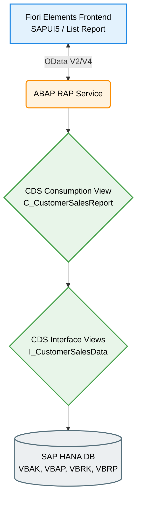
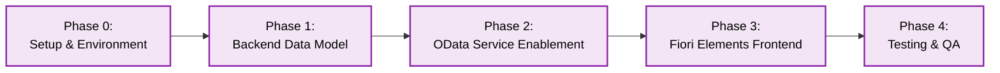

# Customer Sales Report Fiori App

## Overview
The **Customer Sales Report** is a SAP Fiori UI5 application designed to provide sales representatives and managers with a comprehensive, analytical view of sales data. This application enables filtering of data by various criteria, including Customer, Sales Area, Plant, Billing Document Types, and Posting Dates. The results are displayed in an analytical table supporting sorting, grouping, variant management, and export capabilities.

## Features
- **Comprehensive Filtering**: Robust selection screen utilizing `SmartFilterBar` to restrict sales data.
- **Analytical Reporting**: Results displayed in a `SmartTable` supporting advanced data manipulation.
- **Variant Management**: Save and load custom selection criteria and table layouts for efficient daily usage.
- **Export to Excel**: Export analytical data for offline management reporting.
- **Responsive Design**: Fully responsive UI adhering strictly to SAP Fiori Design Guidelines.

## Technical Stack
- **Frontend**: SAPUI5 (version 1.108+), SAP Fiori Elements (List Report Page)
- **Backend**: ABAP RESTful Application Programming Model (RAP), Core Data Services (CDS)
- **Database**: SAP HANA Database (S/4HANA Private Edition)
- **Tooling**: abapGit (backend tracking), OPA5/QUnit (frontend testing), ABAP Unit & ATC (backend testing)

## Architecture

The application utilizes a standard SAP S/4HANA analytical architecture, emphasizing code pushdown to the HANA database for optimal performance.



## Development Process

The development of this report followed a strict Spec-Driven Development approach, separated into clear implementation phases to ensure code quality, performance, and adherence to established constitutions.



### Phase Details
1. **Phase 0 (Setup)**: Initialized backend ABAP packages and frontend Fiori Elements application structure.
2. **Phase 1 (Data Model)**: Developed CDS interface (`I_CustomerSalesData`) and consumption (`C_CustomerSalesReport`) views, implementing HANA code pushdown and necessary UI annotations.
3. **Phase 2 (OData)**: Exposed the consumption view via ABAP RAP Service Definition and Binding.
4. **Phase 3 (Frontend)**: Configured the SAPUI5 `manifest.json` to consume the OData service, validated Smart controls, and implemented i18n translations.
5. **Phase 4 (QA)**: Conducted ABAP Test Cockpit (ATC) checks, ABAP Unit tests, and OPA5 integration testing.

## Project Structure

```text
.
├── .specify/specs/      # Project specifications and implementation plans
├── backend/             # ABAP Backend Artifacts
│   ├── src/             # CDS Views, Behavior Definitions, Service Bindings
│   └── tests/           # ABAP Unit Tests
└── frontend/            # SAPUI5 Fiori Elements Frontend
    ├── webapp/          # Component.js, manifest.json, localService, ext/
    └── ui5.yaml         # UI5 tooling configuration
```

## Running the Frontend Locally

To run the SAPUI5 frontend locally for development and testing:

```bash
cd frontend
npm install
npm run start
```

*Note: This will start a local server, typically available at `http://localhost:8080`. Ensure mock data is configured or the app is appropriately routed to your backend S/4HANA instance.*
